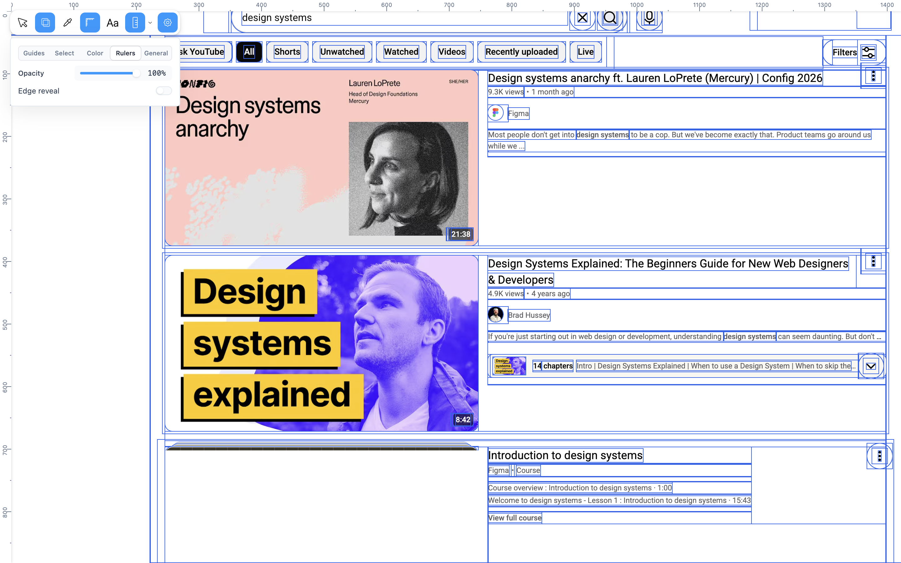
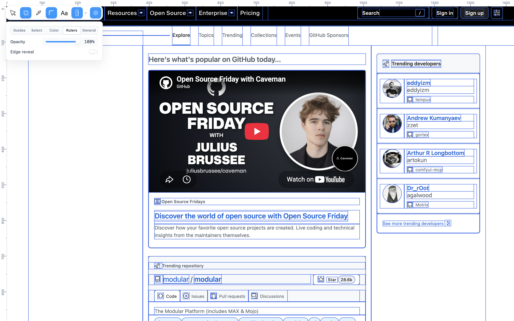
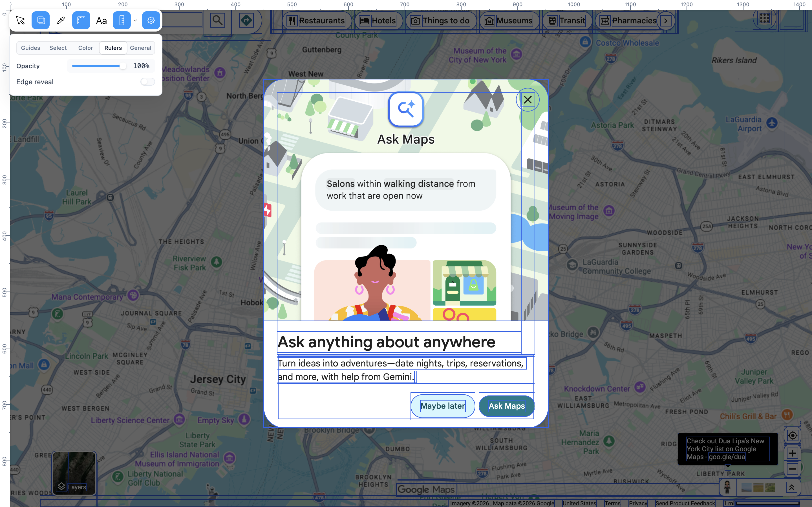
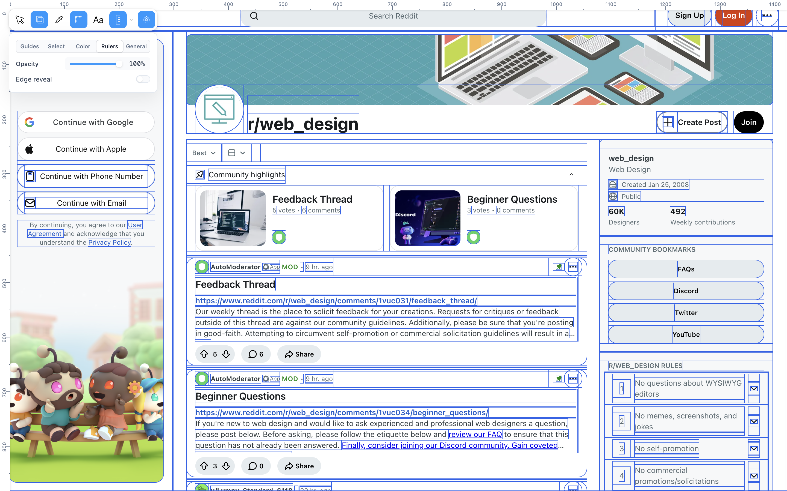
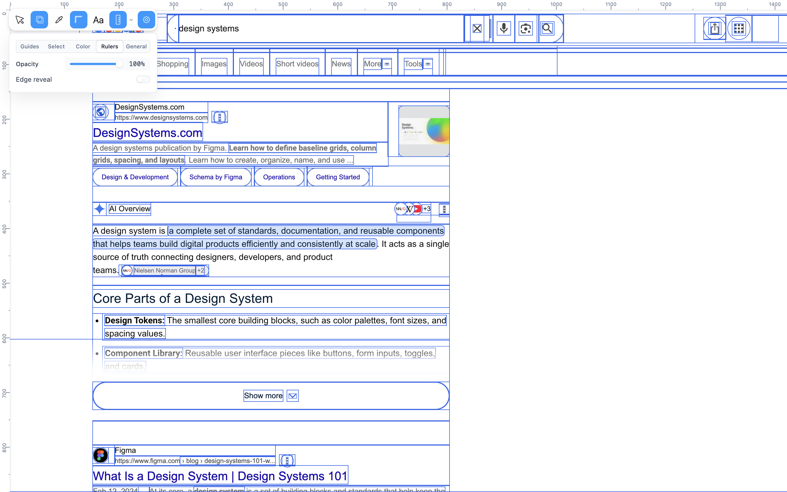
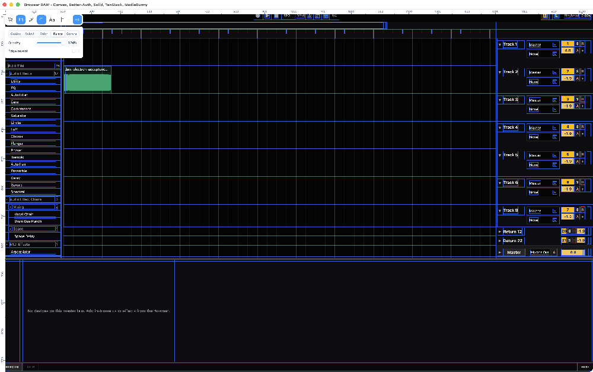

# Mesurer Solid

A framework-agnostic UI measurement, inspection, and extension layer for browser applications and coding agents, built as a Solid 2 port/remix and extension of [Mesurer](https://github.com/ibelick/mesurer), originally created by [Julien Thibeaut (`@ibelick`)](https://github.com/ibelick).

Mesurer Solid is implemented with Solid 2 internally, but that renderer/runtime is bundled into an isolated browser island. Host applications do **not** need Solid 2 and can use Solid 1, Solid 2, React, Vue, Svelte, vanilla DOM, or an Electron renderer.

Mesurer is useful in three ways:

1. **Human devtool** — interactive selection, measurements, guides, rulers, text inspection, X-ray, color picking, distances, settings, history, and persistence.
2. **Agent feedback API** — exact, JSON-safe DOM geometry and computed-style data that coding agents can read through the browser tool they already use.
3. **Composable runtime** — built-ins and third-party extensions share one plugin host, so tools can be added, removed, replaced, or driven by stable commands at runtime.

## Mesurer in action

Mesurer runs as an isolated inspection layer over real applications, including complex stacking, modal/top-layer UI, strict Trusted Types pages, and Electron renderer pages.

<p align="center">
  
</p>

<table>
  <tr>
    <td></td>
    <td></td>
  </tr>
  <tr>
    <td align="center"><sub>GitHub</sub></td>
    <td align="center"><sub>Google Maps</sub></td>
  </tr>
  <tr>
    <td></td>
    <td></td>
  </tr>
  <tr>
    <td align="center"><sub>Reddit</sub></td>
    <td align="center"><sub>Google Search</sub></td>
  </tr>
</table>

### Electron renderer

<p align="center">
  
</p>

<sub>Mesurer running over a packaged Electron application with a Solid 1 renderer.</sub>

## Capabilities at a glance

| Capability | What Mesurer provides |
| --- | --- |
| Framework-independent mounting | `mountMeasurer()` works in browser DOM hosts without sharing the host framework runtime. |
| Isolated UI | ShadowRoot isolation plus a protected host layer so application CSS/stacking is not allowed to casually hide the inspector. |
| Browser top-layer mounting | Modern browsers promote the Mesurer host into a manual popover, escaping ordinary stacking contexts and ancestor clipping. |
| Visual inspection tools | Select, X-ray, color picker, rulers, text inspector, guides, distance overlay, and settings. |
| Exact element inspection | Rect, margin, padding, border, typography, appearance, layout, scroll size, and overflow state. |
| Geometry comparison | Horizontal/vertical gaps and center deltas between elements. |
| Viewport diagnostics | Viewport/document dimensions, DPR, scroll position, and page overflow signals. |
| Agent iteration snapshots | `feedback()` combines requested element measurements, viewport state, loaded capabilities, and plugin state. |
| Stable command surface | Agents and extensions can execute built-in or plugin commands without simulating toolbar clicks. |
| Runtime extensions | Plugins can register tools, commands, hooks, overlays, settings contributions, state, services, and disposal logic. |
| Hot replacement | Plugins can be loaded, removed, or replaced while the mounted instance is alive. Built-in slots can be replaced while retaining stable `builtin.*` command names and shortcuts. |
| History and persistence | Plugin state slices can opt into undo/redo history and browser persistence. Mesurer settings/workspace state can also persist. |
| Transport-neutral injection | A self-contained classic script can be evaluated by an existing browser harness without requiring Playwright or a second CDP connection. |
| Deterministic reinjection | Injecting again disposes the previous injected instance before mounting the new one. |

## The rendered page is the source of truth

For agent-driven UI work, Mesurer is intended to stay in the development loop rather than appear only at final QA.

A source file saying `gap: 16px`, `align-items: center`, or `width: 100%` does **not** prove that the rendered page has the intended spacing, alignment, dimensions, or overflow. Fonts, intrinsic sizing, parent layout, transforms, breakpoints, wrapping, and neighboring components can all change the actual result.

The default design loop is:

```text
user requests a UI/design change
  → agent edits the implementation
  → real app renders / HMR settles
  → __MESURER__.stable()
  → __MESURER__.feedback([...important selectors])
  → outer harness takes a screenshot
  → agent compares exact measurements + pixels to the request
  → agent fixes discrepancies
  → repeat until the rendered result supports the claim
```

Use Mesurer to validate statements such as “these edges align,” “the gap is 16 px,” “all buttons are the same height,” “there is no horizontal overflow,” or “this heading is actually using the intended font.” Use the screenshot to judge composition, hierarchy, balance, clipping, and the things that remain visual rather than numeric.

See [`docs/DESIGN_FEEDBACK_LOOP.md`](./docs/DESIGN_FEEDBACK_LOOP.md) for the practical agent workflow and examples.

## What Mesurer deliberately does not own

Mesurer is **not** a browser driver or an agent orchestration server. It does not own navigation, clicking, typing, screenshots, tabs, authentication, browser lifetime, source editing, or a network RPC listener. Those responsibilities stay with Playwright, Chrome DevTools Protocol, Cypress, a coding-agent browser tool, Electron, or whatever outer harness already controls the page.

That separation is intentional: Mesurer measures and exposes UI state; the outer harness interacts with the browser.

## Install

During the prerelease period:

```bash
bun add -d @jhomra21/mesurer-solid@beta
```

## Agent quick start — inject into your existing harness

**Using Mesurer from an agent should normally require no changes to the target application's source or build.**

The default host-project mutation budget is **zero**. If the harness can execute JavaScript in the current browser page, Electron renderer, WebView, or other DOM host, reuse that path:

```text
existing harness
  → existing page / renderer
  → evaluate @jhomra21/mesurer-solid/inject-script
  → window.__MESURER__
```

Do **not** add Mesurer to application source, create a Mesurer-specific build, add another browser/CDP stack, or introduce project-specific `start:mesurer` / `package:mesurer` commands merely to inspect the UI. Convenience integration is optional only when the user explicitly wants Mesurer embedded or automatically present on every development launch.

The transport-neutral agent entry point is:

```text
@jhomra21/mesurer-solid/inject-script
```

Resolve/read it as text and evaluate it through the JavaScript-execution primitive the harness already owns:

```js
import { readFile } from "node:fs/promises";
import { fileURLToPath } from "node:url";

const source = await readFile(
  fileURLToPath(import.meta.resolve("@jhomra21/mesurer-solid/inject-script")),
  "utf8",
);

await browser.evaluate(source);
await browser.evaluate(`window.__MESURER__.ready()`);
```

Injection exposes:

```text
window.__MESURER__          JSON-safe agent API
window.__MESURER_INSTANCE__ advanced mounted instance/pluginHost access
```

Reinjection is deterministic: the previous injected instance is disposed before the next one mounts.

For packaged applications, prefer the **ordinary packaged artifact** plus an existing attach/evaluate channel. If that artifact can be launched with CDP enabled, launch the same artifact, attach the existing harness, and inject Mesurer. Do not compile Mesurer into a special package merely to inspect the packaged app.

| Situation | Mesurer workflow |
| --- | --- |
| Harness already has browser JavaScript execution | **Inject `/inject-script`** |
| Electron renderer is reachable through existing CDP | **Attach the existing harness + inject** |
| Normal packaged app can be launched with CDP | **Launch the same artifact + inject** |
| User explicitly wants Mesurer every development launch | `mountMeasurer()` may be appropriate |
| No renderer evaluation path exists | Explain the limitation, then consider source integration |
| Agent wants to create a new browser, command, or build just for Mesurer | **Don't; reuse the existing harness** |

Before injection, a harness may optionally set `window.__MESURER_CONFIG__`:

```js
window.__MESURER_CONFIG__ = {
  globalName: "__UI_MEASURE__",
  target: "#app",
  excludePlugins: ["color-picker"],
  persistKey: "my-project:mesurer",
};
```

Harnesses that specifically support ES-module script injection may use `@jhomra21/mesurer-solid/inject` instead. `/inject-script` is the transport-neutral default for generic browser evaluation APIs.

The repository also includes a Playwright reference adapter for manual testing/CI, but it is **not** the agent integration API. Do not launch it when the outer harness already has browser execution capability. See [`docs/BROWSER_HARNESS.md`](./docs/BROWSER_HARNESS.md) and [`AGENTS.md`](./AGENTS.md).

## Optional app integration — mount from source

Use `mountMeasurer()` from application code when the user explicitly wants Mesurer embedded as a persistent development tool, or when no external JavaScript-evaluation path exists.

```ts
import { mountMeasurer } from "@jhomra21/mesurer-solid";

const mesurer = mountMeasurer({
  agent: true,
});

await mesurer.ready;

console.log(mesurer.agent.inspect("[data-testid='save']"));
console.log(mesurer.agent.distance("#sidebar", "main"));

// Later
mesurer.dispose();
```

`mountMeasurer()` creates an isolated ShadowRoot by default and, on browsers with Popover API support, promotes the outer host into the browser top layer so ordinary page stacking contexts and ancestor clipping cannot cover it.

The mounted instance exposes:

- `ready` — resolves after built-ins, the renderer bridge, external plugins, and persisted plugin state settle.
- `agent` — the JSON-safe measurement/command harness.
- `pluginHost` — the live extension host once created.
- `hostLayer` — reports `"top-layer"` or the fixed compatibility fallback.
- `bringToFront()` — explicitly reasserts Mesurer as the newest inspection surface when needed.
- `describe()` — current plugin/capability description.
- `dispose()` — removes the Mesurer island and associated globals/listeners.

Useful mount options include `target`, `isolate`, `shadowMode`, `topLayer`, colors, guide/ruler settings, persistence configuration, external `plugins`, `excludePlugins`, a supplied `pluginHost`, and agent bridge configuration.

See [`docs/HOST_ISOLATION.md`](./docs/HOST_ISOLATION.md) for the host-page layering contract, adversarial test strategy, and explicit guarantee boundaries.

## Agent API

The default global is `window.__MESURER__`.

| Method | Purpose |
| --- | --- |
| `ready()` | Wait for the runtime/plugins and initial layout to settle. |
| `stable(frames?)` | Wait for fonts plus one or more animation frames after HMR or UI edits. |
| `inspect(selector, index?)` | Inspect one matching element. |
| `inspectAll(selector, limit?)` | Inspect multiple matching elements, default limit 50. |
| `at(x, y)` | Inspect the element under a viewport coordinate. |
| `distance(a, b)` | Compare two elements by gap and center deltas. |
| `viewport()` | Read viewport/document dimensions, DPR, scrolling, and overflow. |
| `feedback(selectors?)` | Get one iteration snapshot containing viewport, requested elements, plugin capabilities, and plugin state. |
| `describe()` | List loaded plugins, tools, settings, overlays, state slices, commands, hooks, and services. |
| `command(id, args?)` | Execute a built-in or extension command. |
| `state()` | Serialize all plugin-owned state. |

An element inspection includes identity/text plus:

```text
rect
margin / padding / border
typography: font, size, weight, line height, letter spacing, alignment, color
appearance: background, border color/radius, shadow, opacity
layout: display, position, z-index, overflow, flex/grid fields, transform
scroll: client/scroll dimensions and overflow booleans
```

For meaningful UI/design changes, this loop should be the default verification step, not an optional final check:

```text
edit or interact through the outer harness
  → __MESURER__.stable()
  → __MESURER__.feedback([...important selectors])
  → take a screenshot with the outer harness
  → compare exact geometry + visual pixels
  → repeat
```

Prefer Mesurer's numeric geometry over estimating spacing from screenshots, and prefer the actual rendered measurement over assuming a CSS declaration produced the intended result.

## Stable built-in commands

The runtime bridge exposes these command names:

```text
builtin.select
builtin.xray
builtin.color-picker
builtin.rulers
builtin.text-inspector
builtin.guides
builtin.settings
```

They follow the same behavior path as the corresponding visible controls. The distance feature is an overlay capability rather than a standalone `builtin.distance` command.

## Plugins and extension composition

Plugin authors use the public core subpath:

```ts
import {
  createMesurerPluginHost,
  createMesurerRuntime,
  defineMesurerPlugin,
} from "@jhomra21/mesurer-solid/core";
```

A plugin can register:

```text
tools
commands
hooks
overlays
settings contributions
scoped state slices
opaque services
disposal callbacks
```

Example:

```ts
import { defineMesurerPlugin } from "@jhomra21/mesurer-solid/core";

export const counterPlugin = defineMesurerPlugin({
  id: "example.counter",
  version: "1.0.0",
  setup(ctx) {
    ctx.state.register({
      id: "example.counter.value",
      initial: 0,
      history: true,
      persist: true,
    });

    ctx.command.register("example.counter.increment", () => {
      ctx.state.update<number>("example.counter.value", (value) => value + 1);
    });

    ctx.tool.register({
      id: "example-counter",
      label: "Counter",
      command: "example.counter.increment",
      order: 70,
    });
  },
});
```

Pass plugins at mount time:

```ts
mountMeasurer({ plugins: [counterPlugin] });
```

Or manage them dynamically through `mounted.pluginHost` after `mounted.ready`:

```ts
await mounted.ready;
await mounted.pluginHost?.load(counterPlugin);
mounted.pluginHost?.remove("example.counter");
await mounted.pluginHost?.replace(nextCounterPlugin);
```

### Customize Mesurer by asking your agent

Users do not need to hand-author plugin code. A normal workflow can be:

> “Add a Mesurer plugin that checks whether these cards align to an 8 px spacing grid.”

> “Add a Mesurer tool that highlights overflowing containers.”

> “Replace X-ray with a project-specific overlay that labels our design-system components.”

> “Add a command that measures every toolbar button and reports inconsistent heights.”

The coding agent should generally implement project-specific inspection behavior as a plugin, load it through the public plugin host, and keep Mesurer core reusable.

Built-ins use the same host. You can exclude them with `excludePlugins`, or replace a built-in slot with a plugin contribution that declares the same `builtin` id. Mesurer keeps the stable shortcut and `builtin.<id>` command routing while the replacement is active.

Renderer-aware plugins can request the `runtime:solid` capability through `ctx.service.get("runtime:solid")`. That service provides owner document/window, the portal target, and a `createInspectorMount()` helper for plugin-owned UI. The service is intentionally opaque; extension code should not import private renderer workspaces.

See [`docs/DESIGN_FEEDBACK_LOOP.md`](./docs/DESIGN_FEEDBACK_LOOP.md) for practical extension ideas and [`AGENTS.md`](./AGENTS.md) for the coding-agent contract.

## Built-in feature composition

The root package exports factories for every default built-in plus composition helpers:

```ts
import {
  colorPickerPlugin,
  composeMesurerPlugins,
  defaultMesurerPlugins,
  distancePlugin,
  guidesPlugin,
  rulersPlugin,
  selectPlugin,
  settingsPlugin,
  textInspectorPlugin,
  xrayPlugin,
} from "@jhomra21/mesurer-solid";
```

This lets an integration start with the default feature set, exclude selected built-ins, or compose a custom set without forking Mesurer.

## Public package surface

There is one npm package with four primary public entry points:

```text
@jhomra21/mesurer-solid
@jhomra21/mesurer-solid/core
@jhomra21/mesurer-solid/inject
@jhomra21/mesurer-solid/inject-script
```

- root — mount API, agent harness/types, plugin types/helpers, built-in plugin factories.
- `/core` — framework-neutral plugin/runtime primitives.
- `/inject` — ES-module side-effect injector for browser automation.
- `/inject-script` — self-contained classic-script payload for generic JavaScript evaluation.

## Compatibility and host-page isolation

The supported browser-host boundary is intentionally framework independent:

```text
Solid 1
Solid 2
React
Vue
Svelte
vanilla DOM
Electron renderer
```

We do not attempt to prove compatibility by keeping a list of websites. Instead, package-smoke exercises classes of browser interference against the exact packed artifact: hostile global CSS, transformed/overflow-clipped ancestors, extreme `z-index` overlays, later top-layer popovers, and modal dialogs. Those are the primitives websites compose.

On modern browsers, the preferred manual-popover host lives in the browser top layer, which is above normal document layers and escapes ancestor clipping. The fixed/max-`z-index` path is the compatibility fallback. See [`docs/HOST_ISOLATION.md`](./docs/HOST_ISOLATION.md) for what is guaranteed and what no in-page library can guarantee.

Electron main-process code is not a DOM host. Mount or inject Mesurer inside renderer pages. Mesurer does not import Electron.

The package build fails if public artifacts leak private workspace package names or leave Solid as a runtime dependency for the host application.

## Visual and behavioral parity

The default renderer continues to track the pinned upstream Mesurer UI and behavior. CI compares the Solid renderer against the pinned React reference through screenshot parity, explicit control/icon geometry contracts, interaction gates, and native-3× captures.

Framework independence and plugin composition are architectural changes; they are not permission to silently drift the default UI.

## Development

```bash
bun install
bun run dev
```

Core validation:

```bash
bun run typecheck
bun run test
bun run build
```

The package-smoke workflow packs the exact sanitized npm artifact, installs it into clean consumer hosts, evaluates the packed `inject-script.js` from a React page with no Mesurer source import, and exercises the host-isolation regression contract.

For repository work, also read:

- [`AGENTS.md`](./AGENTS.md) — coding-agent integration and contribution instructions.
- [`docs/BROWSER_HARNESS.md`](./docs/BROWSER_HARNESS.md) — the inject-first browser/Electron harness contract.
- [`docs/DESIGN_FEEDBACK_LOOP.md`](./docs/DESIGN_FEEDBACK_LOOP.md) — how to keep Mesurer in the UI implementation/validation loop.
- [`docs/HOST_ISOLATION.md`](./docs/HOST_ISOLATION.md) — cross-site layering/occlusion invariants and adversarial tests.
- [`ARCHITECTURE.md`](./ARCHITECTURE.md) — internal boundaries and invariants.
- [`RELEASING.md`](./RELEASING.md) — release workflow; do not manually publish normal releases.
- [`THIRD_PARTY_LICENSES.md`](./THIRD_PARTY_LICENSES.md) — upstream attribution.
