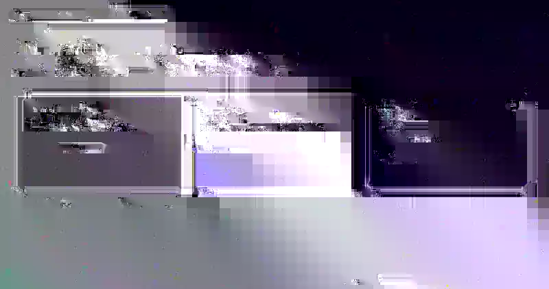

# Mesurer Solid

[](https://www.npmjs.com/package/mesurer-solid)
[](https://github.com/jhomra21/mesurer-solid/actions/workflows/ci.yml)
[](./LICENSE)

A Solid 2 port and extension of [Mesurer](https://github.com/ibelick/mesurer) by [Julien Thibeaut (`@ibelick`)](https://github.com/ibelick), turned into a framework-independent UI inspection layer for browser apps and coding agents.

Mesurer Solid keeps the original inspection experience, but adds a bundled Solid 2 renderer, runtime plugins, shared human/agent visual context, exact programmatic selection, annotation/review workflows, optional screenshot capture, and a portable agent skill.

<p align="center">
  
</p>

<sub>Captured from the published `mesurer-solid@0.1.1` package: two selected targets, an exact 32px gap, live selection context, context tools, and the screenshot camera in the same runtime.</sub>

## Install

```bash
bun add -d mesurer-solid
```

or:

```bash
npm install -D mesurer-solid
```

`mesurer-solid` is the canonical package name. Use `mesurer-solid@beta` only when intentionally testing a prerelease.

## Why this port exists

The renderer is implemented privately with Solid 2 and ships inside Mesurer itself. Your app does **not** need Solid 2.

Mesurer Solid can mount over:

- Solid 1
- Solid 2
- React
- Vue
- Svelte
- vanilla DOM apps
- Electron renderer pages

The result is one isolated inspection/runtime layer that can be used interactively by a person or programmatically by a coding agent.

## What it adds

| Capability | Mesurer Solid |
| --- | --- |
| Original inspection tools | Select, X-ray, Color Picker, Rulers, Text Inspector, Guides, Distance, Settings |
| Framework-independent mount | Bundled Solid 2 renderer with no host-framework runtime requirement |
| Multi-selection | Sparse multi-select plus exact pairwise spacing evidence |
| Shared human/agent state | Human selection, measurements, guides, annotations, and visual state are readable from the page |
| Exact agent selection | `select(selector | selectors)` visibly selects exact rendered targets and returns structured context |
| Rendered verification | Geometry, computed styles, distances, overflow, layout, and deterministic annotation review |
| Runtime plugins | Add/remove tools, commands, overlays, settings, state, services, and lifecycle hooks |
| Screenshot plugin | Drag-region visible-tab PNG capture, HiDPI cropping, copy/download settings, thumbnail, viewer, and extension capture bridge |
| Agent skill | Portable `mesurer-ui` skill plus classic injector for browser-capable coding agents |
| Host isolation | ShadowRoot + protected top-layer/fallback mounting, including hostile CSS and Trusted Types pages |

## Quick start

```ts
import { mountMeasurer } from "mesurer-solid"

const mesurer = mountMeasurer()
```

For local development only:

```ts
if (import.meta.env.DEV) {
  import("mesurer-solid").then(({ mountMeasurer }) => {
    const mesurer = mountMeasurer()
    import.meta.hot?.dispose(() => mesurer.dispose())
  })
}
```

## Add shared visual context

```ts
import {
  contextPlugin,
  mountMeasurer,
} from "mesurer-solid"

const mesurer = mountMeasurer({
  agent: true,
  plugins: [contextPlugin()],
})
```

Now the same rendered state can be consumed by the human and the agent:

```js
const workspace = await window.__MESURER__.context()
const selected = await window.__MESURER__.context({ scope: "selection" })
```

When the agent knows the exact target, it can select it itself instead of asking the user to point at it:

```js
const evidence = await window.__MESURER__.select([
  "#pricing-card",
  "#pricing-cta",
])
```

Every selector must resolve to exactly one rendered element. Missing or ambiguous selectors reject instead of guessing.

### The rendered page is the source of truth

Mesurer is designed around a simple loop:

```text
human selection/annotation OR agent-known target
    ↓
real browser page
    ↓
context() / select() / review()
    ↓
structured rendered evidence
    ↓
source edit
    ↓
real browser page
    ↓
fresh context/review + screenshot when useful
```

A source file saying `gap: 16px` does not prove the browser rendered a 16px gap. Mesurer gives the agent evidence from the actual page.

## Add screenshot capture

Screenshot is an optional first-party plugin:

```ts
import { mountMeasurer } from "mesurer-solid"
import { screenshotPlugin } from "mesurer-solid/screenshot"

const mesurer = mountMeasurer({
  plugins: [
    screenshotPlugin({
      copy: true,
      download: false,
    }),
  ],
})
```

The camera tool supports drag-region visible-tab capture, HiDPI/Retina-aware PNG cropping, persisted copy/download settings, a draggable thumbnail, a larger Copy/Save viewer, and an extension-native capture bridge.

Normal browser hosts use `getDisplayMedia()` with stream reuse. The first-party Chrome extension can use `chrome.tabs.captureVisibleTab()` without a screen-share chooser.

See [`docs/SCREENSHOTS.md`](./docs/SCREENSHOTS.md).

## Agent skill

Install the portable skill into a project:

```bash
npx --yes --package=mesurer-solid mesurer-skill install
```

It installs:

```text
.agents/skills/mesurer-ui/
├── SKILL.md
└── assets/
    └── inject-script.js
```

The skill teaches a browser-capable coding agent to:

- reuse an existing human Mesurer instance instead of destroying its state
- read human selection/annotations first
- self-select exact targets when it already knows them
- consume `MesurerContextV1` after visual operations
- revalidate after edits with fresh rendered evidence
- keep human screenshot capture separate from the agent harness's own screenshot proof

## Runs over real applications

Mesurer Solid is validated as an isolated overlay over normal websites, hostile stacking/CSS cases, strict Trusted Types pages, and Electron renderers.

<table>
  <tr>
    <td></td>
    <td></td>
  </tr>
  <tr>
    <td align="center"><sub>YouTube</sub></td>
    <td align="center"><sub>GitHub</sub></td>
  </tr>
  <tr>
    <td></td>
    <td></td>
  </tr>
  <tr>
    <td align="center"><sub>Google Maps</sub></td>
    <td align="center"><sub>Electron + Solid 1</sub></td>
  </tr>
</table>

## Public API

Main entry:

```ts
import {
  contextPlugin,
  defineMesurerPlugin,
  mountMeasurer,
} from "mesurer-solid"
```

Additional entry points:

```ts
import { createMesurerPluginHost } from "mesurer-solid/core"
import { screenshotPlugin } from "mesurer-solid/screenshot"
```

The classic injectable bundle is available at:

```text
mesurer-solid/inject-script
```

## Docs

- [`ARCHITECTURE.md`](./ARCHITECTURE.md) — package/runtime architecture
- [`packages/mesurer/AGENT_INTEGRATION.md`](./packages/mesurer/AGENT_INTEGRATION.md) — public agent-facing API
- [`docs/CONTEXT_WORKFLOW.md`](./docs/CONTEXT_WORKFLOW.md) — human/agent shared-context workflow
- [`docs/DESIGN_FEEDBACK_LOOP.md`](./docs/DESIGN_FEEDBACK_LOOP.md) — rendered verification loop
- [`docs/SCREENSHOTS.md`](./docs/SCREENSHOTS.md) — screenshot plugin and evidence boundary
- [`docs/UPSTREAM_PARITY.md`](./docs/UPSTREAM_PARITY.md) — upstream React parity baseline and validation
- [`docs/HOST_ISOLATION.md`](./docs/HOST_ISOLATION.md) — hostile CSS/top-layer guarantees
- [`RELEASING.md`](./RELEASING.md) — release process

## Origin and attribution

Mesurer Solid started as a Solid port of [ibelick/mesurer](https://github.com/ibelick/mesurer) and intentionally preserves the original tool's visual language and interaction model where practical.

The project has since grown beyond a renderer port with framework-independent mounting, agent context/review APIs, plugins, screenshot capture, host isolation work, and the portable agent skill.

Original Mesurer copyright and attribution remain documented in [`THIRD_PARTY_LICENSES.md`](./THIRD_PARTY_LICENSES.md).

## License

MIT
