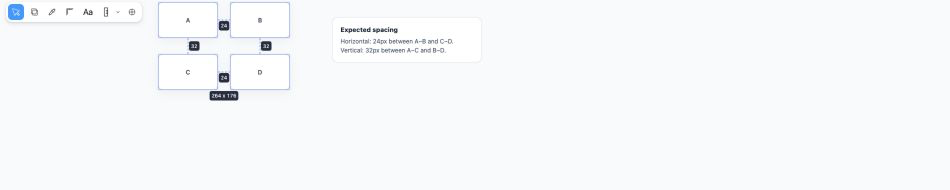
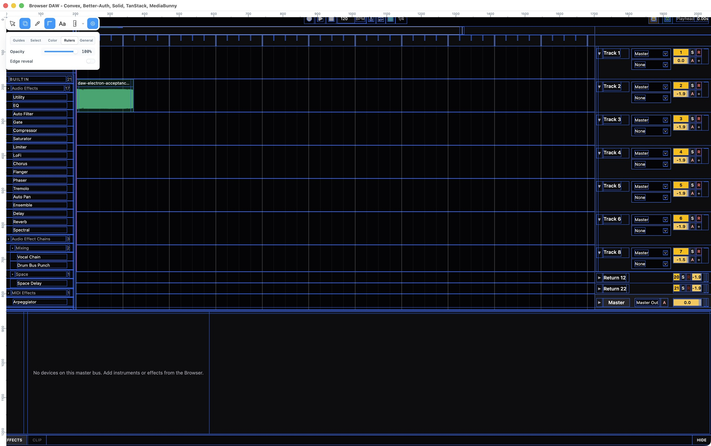

# Mesurer Solid

[](https://www.npmjs.com/package/mesurer-solid)
[](https://github.com/jhomra21/mesurer-solid/actions/workflows/ci.yml)
[](./LICENSE)

A Solid 2 port and extension of [Mesurer](https://github.com/ibelick/mesurer) by [Julien Thibeaut (`@ibelick`)](https://github.com/ibelick).

Mesurer Solid is a visual inspection and measurement tool for browser apps. Use it to select elements, inspect spacing and layout, measure distances, add guides, inspect text and colors, arrange a desired layout, capture screenshots, and expose rendered UI state through a programmatic API.

<p align="center">
  
</p>

<sub>Mesurer Solid measuring the rendered 24px and 32px gaps in a four-element selection.</sub>

## Install

```bash
bun add -d mesurer-solid
```

or:

```bash
npm install -D mesurer-solid
```

Use `mesurer-solid@beta` only when intentionally testing a prerelease.

## Quick start

Mesurer runs in the browser. Mount it once from the client/browser entry for the page you want to inspect, not from server code or build configuration.

**There is no required `src/dev/mesurer.ts` file.** You can mount Mesurer directly in the browser entry your app already has. A separate `dev/mesurer.ts` module is only an optional way to keep inspector setup organized.

Typical browser entry locations:

| Application | Typical location |
| --- | --- |
| React + Vite | `src/main.tsx` |
| Solid + Vite | `src/index.tsx`, `src/main.tsx`, or the project browser entry |
| Vue + Vite | `src/main.ts` |
| Svelte + Vite | `src/main.ts` |
| Vanilla Vite | `src/main.ts` or `src/main.js` |
| Electron | renderer entry such as `src/renderer.ts` or `src/renderer/main.tsx` |
| SSR / metaframework | client-only module or lifecycle that never executes during SSR |

### Simplest: put Mesurer in that existing entry file

For example, if your React + Vite app already starts in `src/main.tsx`, Mesurer can live right there:

```tsx
import { createRoot } from "react-dom/client"
import { mountMesurer } from "mesurer-solid"
import { App } from "./App"

if (import.meta.env.DEV) {
  const mesurer = mountMesurer()

  if (import.meta.hot) {
    import.meta.hot.dispose(() => mesurer.dispose())
  }
}

createRoot(document.getElementById("root")!).render(<App />)
```

The same pattern works in a Solid browser entry such as `src/main.tsx` or `src/index.tsx`:

```tsx
import { render } from "solid-js/web"
import { mountMesurer } from "mesurer-solid"
import App from "./App"

if (import.meta.env.DEV) {
  const mesurer = mountMesurer()

  if (import.meta.hot) {
    import.meta.hot.dispose(() => mesurer.dispose())
  }
}

render(() => <App />, document.getElementById("root")!)
```

For Vue, Svelte, or vanilla Vite, put the same Mesurer block in the existing `src/main.ts` or `src/main.js` next to the code that starts the browser app. For Electron, put it in the renderer entry, not the Electron main process.

`import.meta.env.DEV` and `import.meta.hot` are Vite-specific. With another bundler, use its build-time development flag and HMR cleanup mechanism instead.

### Optional: keep Mesurer in a separate development module

If you prefer to keep inspector setup out of the app entry, this is also valid:

```text
src/
├── main.tsx          # your existing browser entry; the filename may differ
└── dev/
    └── mesurer.ts    # optional Mesurer-only helper
```

Create `src/dev/mesurer.ts`:

```ts
import { mountMesurer } from "mesurer-solid"

const mesurer = mountMesurer()

if (import.meta.hot) {
  import.meta.hot.dispose(() => mesurer.dispose())
}
```

Then load it from your existing browser entry:

```ts
if (import.meta.env.DEV) {
  void import("./dev/mesurer")
}
```

Both approaches mount Mesurer in the same conceptual place: the browser entry for the page you want to inspect. The helper module only moves Mesurer-specific code out of that file.

If you intentionally want Mesurer in every build of a browser bundle, call `mountMesurer()` without the development guard in that same browser entry.

In SSR/metaframework apps, mount Mesurer only from a client-only module or lifecycle that never runs during server rendering.

Do not put `mountMesurer()` in `vite.config.ts`, API/server routes, Node-only scripts, an Electron main process, or a shared SSR module that also executes on the server.

Add plugins in the same place you mount Mesurer—either directly in the browser entry or in the optional Mesurer helper module. See [`docs/GETTING_STARTED.md`](./docs/GETTING_STARTED.md) for detailed placement examples, Vite/HMR setup, client-only/SSR guidance, Electron placement, and plugin examples.

Mesurer carries its own isolated Solid 2 renderer, so the host app does not need Solid.

## What you can do

| Feature | What it does |
| --- | --- |
| Select | Inspect one or multiple rendered elements |
| Distance | Measure exact spacing and geometry between elements |
| Guides & rulers | Add visual alignment and position references |
| X-ray | Inspect page structure visually |
| Color Picker | Use the browser's native screen sampler when `EyeDropper` is operational; the tool is hidden in unsupported hosts |
| Text Inspector | Inspect rendered typography and double-click Desired text to make a reversible preview edit |
| Settings | Configure tools and persisted behavior |
| Arrange | Move selected elements into a desired visual layout without editing application source |
| Screenshots | Capture a dragged viewport region with the optional screenshot plugin |
| Context & annotations | Read selections, measurements, guides, notes, geometry, styles, and relationships programmatically |
| Plugins | Add or replace tools, commands, overlays, settings, state, and services at runtime |

### Keyboard shortcuts

The default renderer and first-party plugins expose shortcuts only while their corresponding tools are available:

| Shortcut | Action |
| --- | --- |
| `M` | Toggle Mesurer visibility |
| `S` | Select |
| `X` | X-ray |
| `P` | Native Color Picker when supported |
| `R` | Rulers |
| `A` | Text Inspector |
| `G` | Guides |
| `H` / `V` | Choose horizontal / vertical guide orientation |
| `Alt` / `Option` | Distance overlay |
| `Cmd/Ctrl + ,` | Settings |
| `Shift + A` | Arrange when `arrangePlugin()` is mounted |
| `Shift + S` | Screenshot when `screenshotPlugin()` is mounted |
| `C` | Copy Context when `contextPlugin()` is mounted |
| `Shift + C` | Copy Selection when `contextPlugin()` is mounted |
| `N` | Add Note when `contextPlugin()` is mounted |

Color Picker intentionally has no DOM/CSS sampling fallback. In hosts where native screen sampling cannot operate—including the current Codex browser bridge—the Color Picker control is not advertised and `P` is inert.

## Arrange a desired layout

Arrange is an optional first-party plugin for showing how selected UI should be positioned without pretending to edit the application source:

```ts
import { mountMesurer } from "mesurer-solid"
import { arrangePlugin } from "mesurer-solid/arrange"

const mesurer = mountMesurer({
  agent: true,
  plugins: [arrangePlugin()],
})
```

Select one or more elements, click **Arrange** or press **Shift+A**, and drag the selection. Arrange activates Select automatically and stays coordinated with selection state. Hold **Shift** while dragging to lock movement to the dominant axis.

Each completed drag records Before and Desired geometry, persists through the plugin state channel, and participates in Mesurer undo/redo. Coding agents can reconstruct Before/Desired, capture both through their existing browser harness, switch to Live after editing source, and use exact geometry to verify whether the real implementation matches the human-arranged result.

Arrange is primarily a human/designer intent tool: move the rendered UI to where it should be, then tell the coding agent to check Mesurer context. When the Agent Skill is installed, a broad request to check Mesurer/context tells the agent to inspect all existing human intent before editing—including Arrange intents, annotations, current selection, guides, measurements, held distances, and related target/layout context—so the user does not need to separately describe each adjustment.

Arrange is a visual specification: an agent should implement the appropriate flex/grid/spacing/component change rather than blindly copying the preview offset into a production transform.

See [`docs/ARRANGE.md`](./docs/ARRANGE.md) for the human workflow, agent API, Before/Desired/Live states, persistence, screenshots, and review loop.

## Screenshot capture

Add screenshot capture in the same Mesurer mounting module used in the quick start:

```ts
import { mountMesurer } from "mesurer-solid"
import { screenshotPlugin } from "mesurer-solid/screenshot"

const mesurer = mountMesurer({
  plugins: [
    screenshotPlugin({
      copy: true,
      download: false,
    }),
  ],
})
```

The camera tool supports **Shift+S**, drag-region visible-tab capture, HiDPI/Retina-aware PNG cropping, copy/download settings, a draggable thumbnail, and a larger Copy/Save viewer.

See [`docs/SCREENSHOTS.md`](./docs/SCREENSHOTS.md) for screenshot options and browser/extension behavior.

## Programmatic selection and context

Add the context plugin in that same Mesurer mounting module when you want rendered UI state available through the API:

```ts
import {
  contextPlugin,
  mountMesurer,
} from "mesurer-solid"

const mesurer = mountMesurer({
  agent: true,
  plugins: [contextPlugin()],
})
```

Read the current workspace or selection:

```ts
const workspace = await mesurer.context()
const selected = await mesurer.context({ scope: "selection" })
```

Select exact rendered targets from code and get their context back:

```ts
const selected = await mesurer.select([
  "#pricing-card",
  "#pricing-cta",
])
```

Every selector must resolve to exactly one rendered element. Missing or ambiguous selectors reject instead of guessing.

After the page changes, wait for the UI to settle and inspect it again:

```ts
await mesurer.agent.stable()
const selected = await mesurer.context({ scope: "selection" })
```

`MesurerContextV1` includes rendered geometry, computed styles, typography, layout, overflow, guides, measurements, distances, selected targets, and annotated regions.

## Annotations and review

Mesurer Solid context annotations attach a note to rendered UI and keep a baseline that can be reviewed again after changes:

```ts
const annotation = await mesurer.context({ annotation: annotationId })
const review = await mesurer.review(annotationId)
```

This is useful when a visual change needs to be checked against the same target or region after an edit. Mesurer Solid intentionally uses this target-bound semantic review model instead of upstream `0.1.1`'s freeform arrow, pen, and text drawing canvas: agents can read what element/region the note belongs to plus its geometry, layout, measurements, distances, and related rendered evidence directly, without inferring intent from a drawn arrow or screenshot.

## Agent integration

For coding-agent setup, injection, state-preservation rules, Arrange handling, and the full visual verification workflow, use the dedicated agent docs instead of the README:

- [`packages/mesurer/AGENT_INTEGRATION.md`](./packages/mesurer/AGENT_INTEGRATION.md)
- [`.agents/skills/mesurer-ui/SKILL.md`](./.agents/skills/mesurer-ui/SKILL.md)

Install the portable skill with:

```bash
npx --yes --package=mesurer-solid mesurer-skill install
```

The skill treats broad requests such as “check Mesurer,” “check Measure,” or “look at Mesurer context” as a full intent sweep. It preserves and reads existing Arrange, annotation, selection, guide, measurement, and distance state before the agent narrows its work or edits source.

## Supported hosts

The renderer is bundled and isolated from the host framework. Mesurer Solid can run over:

- Solid 1
- Solid 2
- React
- Vue
- Svelte
- vanilla DOM apps
- Electron renderer pages

## Runs over real applications

<table>
  <tr>
    <td></td>
    <td></td>
  </tr>
  <tr>
    <td align="center"><sub>YouTube</sub></td>
    <td align="center"><sub>GitHub</sub></td>
  </tr>
  <tr>
    <td></td>
    <td></td>
  </tr>
  <tr>
    <td align="center"><sub>Google Maps</sub></td>
    <td align="center"><sub>Electron + Solid 1</sub></td>
  </tr>
</table>

## Public entry points

```ts
import {
  contextPlugin,
  defineMesurerPlugin,
  mountMesurer,
} from "mesurer-solid"

import { arrangePlugin } from "mesurer-solid/arrange"
import { createMesurerPluginHost } from "mesurer-solid/core"
import { screenshotPlugin } from "mesurer-solid/screenshot"
```

The classic injectable browser bundle is available at:

```text
mesurer-solid/inject-script
```

## Docs

- [`docs/GETTING_STARTED.md`](./docs/GETTING_STARTED.md) — where to mount Mesurer and development/client setup
- [`docs/ARRANGE.md`](./docs/ARRANGE.md) — Arrange visual layout intent and agent review
- [`docs/SCREENSHOTS.md`](./docs/SCREENSHOTS.md) — screenshot plugin
- [`docs/CONTEXT_WORKFLOW.md`](./docs/CONTEXT_WORKFLOW.md) — context, selection, annotations, and review
- [`docs/HOST_ISOLATION.md`](./docs/HOST_ISOLATION.md) — host isolation and browser compatibility
- [`docs/UPSTREAM_PARITY.md`](./docs/UPSTREAM_PARITY.md) — upstream Mesurer audit and intentional product decisions
- [`packages/mesurer/AGENT_INTEGRATION.md`](./packages/mesurer/AGENT_INTEGRATION.md) — agent-specific setup and API usage

## Origin and attribution

Mesurer Solid started as a Solid port of [ibelick/mesurer](https://github.com/ibelick/mesurer) and preserves the original tool's visual language and interaction model where those contracts are adopted.

The current upstream audit is pinned in [`docs/UPSTREAM_PARITY.md`](./docs/UPSTREAM_PARITY.md). Newer upstream features are evaluated individually rather than assumed to be part of Mesurer Solid.

Original Mesurer copyright and attribution are documented in [`THIRD_PARTY_LICENSES.md`](./THIRD_PARTY_LICENSES.md).

## License

MIT