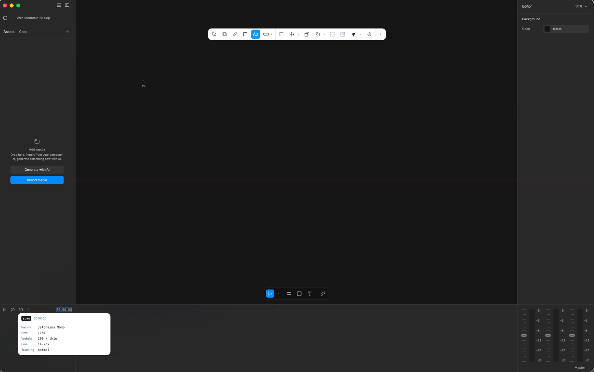
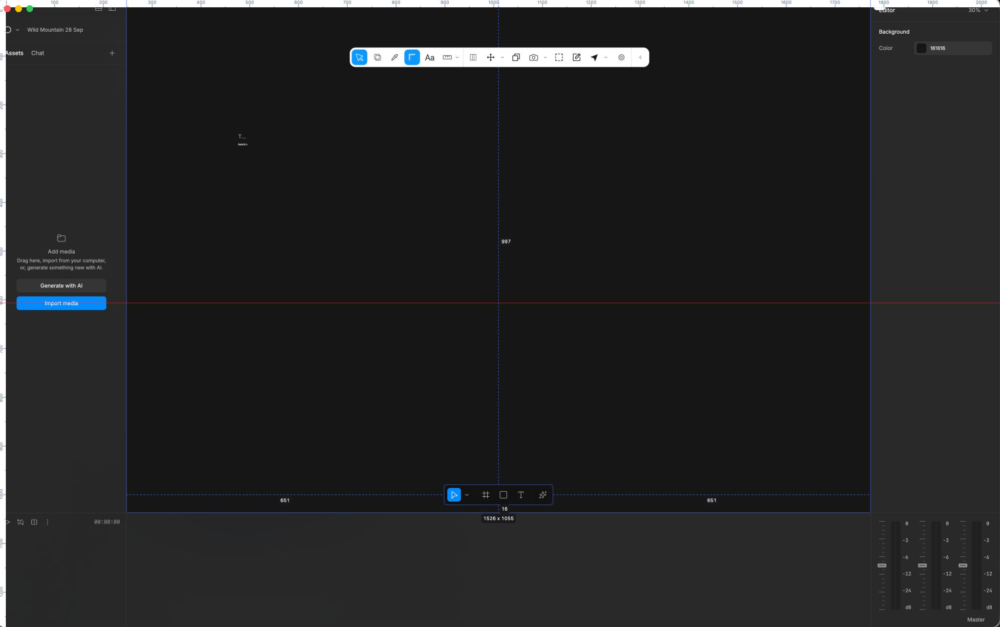

# Mesurer Solid

[](https://www.npmjs.com/package/mesurer-solid)
[](https://github.com/jhomra21/mesurer-solid/actions/workflows/ci.yml)
[](./LICENSE)

Inspect, measure, and express visual intent directly on a live browser UI.

Mesurer Solid ports [Mesurer](https://github.com/ibelick/mesurer) by [Julien Thibeaut](https://github.com/ibelick) to a private Solid 2 renderer. It adds framework-independent mounting, plugins, agent-readable Context, reversible layout and text intent, screenshot and video capture, and host isolation.

The renderer carries its own isolated Solid 2 runtime. Your application can use Solid 1 or 2, React, Vue, Svelte, vanilla DOM, or an Electron renderer without installing Solid for Mesurer.

**Current stable:** `mesurer-solid@0.2.1` on the `latest` dist-tag.

<p align="center">
  
</p>

<p align="center">
  
  
</p>

## Installation

```bash
bun add -d mesurer-solid@latest
```

or:

```bash
npm install -D mesurer-solid@latest
```


## Usage

Mount Mesurer once from the browser entry for the page you want to inspect:

```ts
import { mountMesurer } from "mesurer-solid"

if (import.meta.env.DEV) {
  const mesurer = mountMesurer()

  if (import.meta.hot) {
    import.meta.hot.dispose(() => mesurer.dispose())
  }
}
```

For Vite, that usually means `src/main.tsx`, `src/main.ts`, or the equivalent browser entry. In Electron, mount Mesurer from the renderer entry. If preload exposes `window.__MESURER_HOST__.captureScreenshot`, Screenshot uses native window capture and Color Picker samples the current application window through the same capability. For Recording, import `mesurer-solid/electron` once from Electron main before creating BrowserWindows; Mesurer owns the narrow Recording preload/IPC path. In SSR applications, mount from a client-only boundary. Do not mount Mesurer from server code, build configuration, or an Electron main process.

The returned handle owns the mount. `dispose()` is idempotent, `ready` resolves to the live plugin host after startup and the initial rendered state settle, and an optional `AbortSignal` can own cleanup. See [Getting started](./docs/GETTING_STARTED.md) for lifecycle, framework placement, and HMR guidance. The [Electron renderer example](./examples/electron-renderer/README.md) documents native current-window capture for Screenshot and Color Picker through preload and `webContents.capturePage()`.

### Add first-party plugins

All first-party plugin factories live at `mesurer-solid/plugins` and use the plugin name directly:

```ts
import { mountMesurer } from "mesurer-solid"
import { context, edit, layoutGuides, recording, screenshot } from "mesurer-solid/plugins"

const mesurer = mountMesurer({
  agent: true,
  plugins: [
    context(),
    edit(),
    layoutGuides(),
    screenshot(),
    recording(),
  ],
})
```

The same entry exposes the built-in factories for lower-level composition. Normal `mountMesurer()` callers do not need to rebuild the built-in set. Use `excludeBuiltins` with public names such as `"xray"`, `"typography"`, or `"colorPicker"` when a built-in should be omitted.

Optional plugin capabilities resolve through `await mesurer.service<T>(serviceId)`. The method waits for startup and preserves any value the plugin registered, including `false`, `0`, and empty strings.

## Features

- **Select.** Inspect one or more rendered HTML or SVG elements. Turning Select off clears the current element and Guide selection instead of retaining hidden selection state.
- **Distance.** Measure spacing and geometry, including pairwise multi-selection spacing.
- **X-ray, Guides, and Rulers.** Inspect page structure and alignment.
- **Layout Guides.** Add page-scoped columns, rows, or a pixel grid through the optional `layoutGuides()` plugin. Layout Guide mutations participate in plugin history, and Context includes the current page's saved guides with their visibility state.
- **Typography.** Inspect rendered text and computed type styles in Select mode.
- **Edit.** Move selected HTML elements and edit direct text, typography, and text color as reversible Desired intent.
- **Screenshots.** Capture a dragged page region with the optional Screenshot plugin. It selects application-native capture, the Chromium extension adapter, or browser display capture internally.
- **Recording.** Select and adjust a page region, then record the live application while it remains interactive. Recording defaults to 60 fps with an optional 120 fps setting; MediaBunny owns encoding, trim, 1×/2×/3× resize, format detection, and WebM/MP4 export while browser, extension, and Electron APIs only acquire the live source.
- **Context and annotations.** Expose selection, geometry, styles, measurements, guides, notes, and human intent to code or coding agents. Saved annotations persist across same-tab reloads, conservatively rebind to their original DOM targets, stay attached through scrolling, keep repeated-note markers local, leave Add Note available while a saved note is open, and keep cards/composers above Select hover and selection chrome.
- **Plugins.** Add tools, commands, overlays, settings, state, hooks, and services at runtime.
- **Compact toolbar.** Collapse inactive controls while every active tool remains visible. Expanding restores the same toolbar order and state.
- **Appearance.** Use System, Light, or Dark without changing the inspected page. The same theme applies to the isolated toolbar and document-backed Context and Typography UI.
- **Color Picker.** Native hosts with `window.__MESURER_HOST__.captureScreenshot` use a current-window picker that captures once when the user chooses a pixel. Other supported browser hosts use the native `EyeDropper`. A successful sample is copied to the clipboard in the configured format.

Mesurer Solid has two toolbar modes. **Select** owns selection-first inspection and capture tools such as X-ray, Color Picker, Typography, Screenshot, and Recording. **Edit** owns element movement and direct text/style editing. Rulers, ordinary Guides, and Layout Guides remain available in both modes so alignment evidence does not disappear while editing. Use `1` for Select and `2` for Edit. Context and Codex also remain visible in both modes. Mode changes use the audited upstream grouped-toolbar structure and styling with Mesurer Solid's 150 ms motion. Select keeps the upstream inspection icon; Edit intentionally uses Mesurer Solid's movement glyph and owns its options chevron.

Toolbar dragging starts only after the pointer crosses the drag threshold. A drag from Settings, Guide, or plugin triggers closes the open menu or panel. Pointer activity inside menus, dialogs, form controls, editable regions, and sliders stays with those controls.

Select, point inspection, Context, and annotations accept rendered HTML and SVG elements. Edit movement and direct text editing only mutate HTML elements.

Page-owned workspace evidence is scoped by the current route, including sorted query parameters. Navigating within one tab swaps the relevant page workspace instead of carrying guides and selections to another route. The toolbar keeps its tab-session position across those route changes and reloads.

## Appearance

Mesurer follows the system color scheme by default. Choose **System**, **Light**, or **Dark** under **Settings > General > Appearance**, or set the initial mode when mounting:

```ts
mountMesurer({ theme: "dark" })
```

The selected mode is stored with the other Mesurer settings. System mode responds to `prefers-color-scheme` without changing the stored value. Mesurer applies the active theme to its isolated renderer and to document-backed Context, Typography, direct-edit, and selection UI.

## Shortcuts

Global shortcuts are enabled by default. Turn them off from **Settings > General > Shortcuts** or mount with `shortcutsEnabled: false`. Disabling global shortcuts does not disable toolbar controls, editor-local keyboard behavior, or Escape/cancel handling.

| Shortcut | Action |
| --- | --- |
| `M` | Toggle Mesurer |
| `1` | Select mode |
| `2` | Edit mode |
| `S` | Select |
| `X` | X-ray |
| `P` | Color Picker when supported |
| `R` | Rulers |
| `A` | Typography |
| `G` | Guides |
| `L` | Layout Guides when the plugin is enabled |
| `H` / `V` | Horizontal / vertical guide orientation |
| `Alt` / `Option` | Distance overlay |
| `Cmd/Ctrl + ,` | Settings |
| `Shift + A` | Edit mode compatibility shortcut |
| `Shift + S` | Screenshot |
| `Shift + R` | Recording |
| `C` | Copy Context |
| `Shift + C` | Copy Selection |
| `N` | Add Note |

Plugin shortcuts appear only when the corresponding plugin is mounted and enabled.

## Direct text editing

With Edit active, double-click ordinary direct text to edit it on the rendered page. Mesurer previews the text and typography as reversible Desired intent; it does not write source code. Typography in Select remains inspection-only.

Direct edit owns the visible selection UI for the field. One edit ring remains visible. When the Typography card is below the target, the dimensions pill keeps a 2px gap on each side. Pointer movement does not reposition the card. The selection-adjacent Add Note button is hidden only while editing and returns when the editor closes. Saved annotations remain available.

Native editing stays native. Mesurer does not intercept form controls or descendants that inherit `contenteditable`. A nested `contenteditable="false"` boundary ends that inherited editable region, so an otherwise valid direct-text target inside it can use Mesurer editing.

Mixed inline copy is targeted one direct text run at a time. Text before or after inline children such as `<kbd>2</kbd>` can be edited without flattening, recreating, or replacing those children, and Mesurer leaves the host element's native DOM APIs intact.

Undo and redo update the Desired preview while the DOM still contains the value Mesurer applied. If the application changes the value, Mesurer stops managing it and preserves the application change.

See [Direct text editing and Typography](./docs/TEXT_EDITING.md).

## Edit

Edit combines reversible layout movement with direct text and typography editing. Enter Edit with the mode switch or `2`, select HTML elements, then drag them or double-click direct text to edit copy and typography. Text controls include family, size, weight, line height, tracking, formatting, and color.

Movement keeps the existing Arrange intent and agent contracts so persisted state and integrations remain compatible. The public plugin factory is `edit()`; `arrange()` remains an alias.

See [Edit](./docs/EDIT.md) and [Direct text editing and Typography](./docs/TEXT_EDITING.md).

## Agent integration

Enable the agent bridge when a coding agent should read the same rendered state and human intent:

```ts
import { mountMesurer } from "mesurer-solid"
import { context, edit } from "mesurer-solid/plugins"

const mesurer = mountMesurer({
  agent: true,
  plugins: [context(), edit()],
})
```

Read context or select exact rendered targets:

```ts
const workspace = await mesurer.context()
const selected = await mesurer.select(["#pricing-card", "#pricing-cta"])
```

The portable Mesurer skill teaches compatible agents to preserve existing human state, consume Edit movement, text, and annotation intent before editing source, and verify the real Live result afterward:

```bash
npx --yes --package=mesurer-solid@latest mesurer-skill install
```

See [Agent integration](./packages/mesurer/AGENT_INTEGRATION.md) and the packaged [`mesurer-ui` skill](./.agents/skills/mesurer-ui/SKILL.md).

### Queue human feedback to Codex

Codex is Mesurer's human-triggered **Settings -> Plugins** integration for queueing Context into local Codex threads. It is separate from the Mesurer Solid ChatGPT/Codex agent plugin.

Browser hosts list Codex and start it off by default. Enabling it connects to the local **Mesurer Codex Bridge** companion on `127.0.0.1:47365`. Mesurer verifies the helper's identity, protocol, and capabilities before sending anything, reuses compatible helpers across checkouts even when their source hashes differ, distinguishes missing/outdated/conflicting/unauthorized-origin states, and reconnects automatically when a compatible helper appears. Localhost/127 pages are allowed by default; non-loopback browser origins must be explicitly allowlisted on the local bridge. Electron hosts can instead expose `window.__MESURER_HOST__.codexBridge(request)` from preload and use the in-process native transport directly.

Electron applications install `installMesurerCodexHost()` from `mesurer-solid/plugins/codex/bridge` in main and expose `createMesurerCodexPreloadBridge()` from `mesurer-solid/plugins/codex/preload`. Both transports expose the same `codex:v1` service and **Queue to Codex** UI. Turning the browser plugin off cleans page-owned polling/tools but does not kill the shared helper; Electron disable releases only its renderer lease. Neither path stops Codex's shared daemon or opens Codex Desktop's private app-tools pipe.

**Queue to Codex** targets only a destination Mesurer can identify safely. Shared delivery tracks exact Queued, Working, Finished, or Interrupted lifecycle state. Desktop current-thread delivery keeps its durable queue receipt visible without inventing lifecycle state that remains private to Desktop. Mesurer never creates a new thread or invokes Steer.

See [Queue Context feedback to Codex](./docs/CODEX.md) for native-host wiring, loaded-thread routing, recovery, and the typed `codex:v1` service.

## ChatGPT and Codex plugin prototype

The repository includes a local-first plugin prototype for ChatGPT Desktop and Codex. Mesurer remains browser-first: an agent with browser/computer-use controls can operate the actual Mesurer UI directly, while the optional local MCP provides structured shortcuts for exact inspection, measurements, Context, selection, saved intent, and Live review.

The prototype runs beside the browser or Electron application on the same machine, VM, or sandbox. It does not require a hosted Mesurer relay.

See [ChatGPT and Codex plugin](./docs/CHATGPT_CODEX_PLUGIN.md).

## Documentation

Start with the [documentation index](./docs/README.md).

- [Capabilities](./docs/CAPABILITIES.md)
- [Getting started](./docs/GETTING_STARTED.md)
- [Direct text editing and Typography](./docs/TEXT_EDITING.md)
- [Edit](./docs/EDIT.md)
- [Arrange compatibility](./docs/ARRANGE.md)
- [Layout Guides](./docs/LAYOUT_GUIDES.md)
- [Measurements and distance geometry](./docs/MEASUREMENTS.md)
- [Screenshots](./docs/SCREENSHOTS.md)
- [Recording](./docs/RECORDING.md)
- [Electron renderer example](./examples/electron-renderer/README.md)
- [Context workflow](./docs/CONTEXT_WORKFLOW.md)
- [Queue Context feedback to Codex](./docs/CODEX.md)
- [Browser and agent integration](./docs/BROWSER_HARNESS.md)
- [Host isolation](./docs/HOST_ISOLATION.md)
- [Trusted Types](./docs/TRUSTED_TYPES.md)
- [Upstream parity](./docs/UPSTREAM_PARITY.md)
- [Architecture](./ARCHITECTURE.md)
- [Repository structure](./docs/REPOSITORY_STRUCTURE.md)
- [Contributing](./CONTRIBUTING.md)

## Development

Contributor setup, validation expectations, and repository ownership are documented in [CONTRIBUTING.md](./CONTRIBUTING.md) and [Repository structure](./docs/REPOSITORY_STRUCTURE.md).

## Upstream

Mesurer Solid tracks upstream Mesurer source rather than recreating its UI from memory. The current upstream audit is pinned to `ibelick/mesurer@26110edbbd8cd9c22c32a82b1b91073912fbdfc2` (`v0.2.3`, verified October 3, 2026); adopted behavior and deliberate product differences are recorded in [Upstream parity](./docs/UPSTREAM_PARITY.md).

## License

MIT. See [LICENSE](./LICENSE) and [THIRD_PARTY_LICENSES.md](./THIRD_PARTY_LICENSES.md).